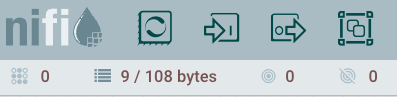
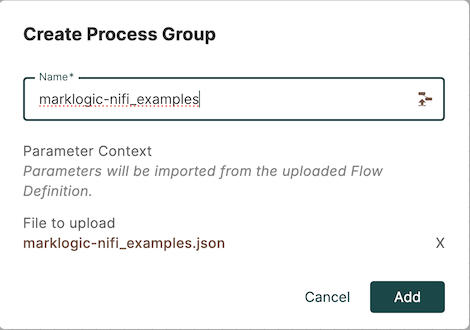

## Setup

To get started with the MarkLogic connector, first 
[install NiFi](https://nifi.apache.org/docs/nifi-docs/html/getting-started.html#downloading-and-installing-nifi) if 
you do not already have it installed. Likewise, if you do not yet have an instance of MarkLogic running, you will 
need to [install MarkLogic](https://docs.marklogic.com/11.0/guide/installation-guide/en/installation-guide-for-all-platforms.html)
as well.

The MarkLogic connector consists of two NAR (NiFi ARchive) files. These two files can be obtained for from the 
[releases pages for the connector](https://github.com/marklogic/nifi/releases). Choose a release and then download and 
copy the two files to the `NIFI_HOME/lib` directory in your NiFi installation. Depending on how you installed NiFi, 
you may instead need to copy the files into the `NIFI_HOME/libexec/lib` directory of your NiFI installation.

After adding the connector to your NiFi installation, you can 
[start NiFi](https://nifi.apache.org/docs/nifi-docs/html/getting-started.html#starting-nifi) and begin making use of 
the [connector components](components/components.md) in your NiFi flows.

If this is your first time starting NiFi, you will most likely need to read 
[this section in the NiFi docs](https://nifi.apache.org/docs/nifi-docs/html/getting-started.html#i-started-nifi-now-what)
that explains how to set a username and password for logging into NiFi. 

## Example flows

The [examples directory](https://github.com/marklogic/nifi/tree/master/examples) in this project's repository 
contains a NiFi file containing flow definitions that demonstrate several MarkLogic processors in action. Loading 
the `marklogic-nifi_examples.json` file into your NiFi application is the quickest way to try out the MarkLogic 
connector. To use this file, you will first need to either clone this repository locally, or you can
[access the file via your web browser](https://raw.githubusercontent.com/marklogic/nifi/master/examples/marklogic-nifi_examples.json)
and save it locally to your workstation.

To load the file, go to the NiFi user interface via a web browser; if you are running NiFi locally, the URL for 
this is likely <https://localhost:8443/nifi/>.

Then, in the NiFi header, click on the icon for creating a new Process Group; the icon is represented by a square with 
two smaller squares inside it and is the furthest icon on the right in the image below:

Click on that icon and drag it onto the NiFi canvas. NiFi will display a dialog  titled "Add Process Group". In the 
"Process Group Name" text field in this dialog, do not enter a name. Instead, click on the icon on the right side of 
the text field. This will open a file dialog; select the `marklogic-nifi_examples.json` file that you either 
downloaded from your web browser or have available via a clone of this repository. NiFi will display the file that 
you chose:

Click "Add" to add the new process group containing the configuration in the `marklogic-nifi_examples.json` file. 

Then, double-click on the new "marklogic-nifi_examples" process group in your NiFi canvas. The labels in the process 
group will provide instructions on how to try each of the flows within the process group.

After trying out these examples, see the list of [connector components](components/components.md) to understand the 
features provided by the MarkLogic connector for NiFi.

You may also wish to see the [older NiFi examples](https://github.com/marklogic/nifi/tree/gh-pages/files) for this 
connector. These examples are no longer maintained and may not work with the latest NiFi version.
